*Langkah-langkah HTML dan CSS Praktikum Web*

1. membuat Dokumen HTML
buatlah dokumen seperti ini
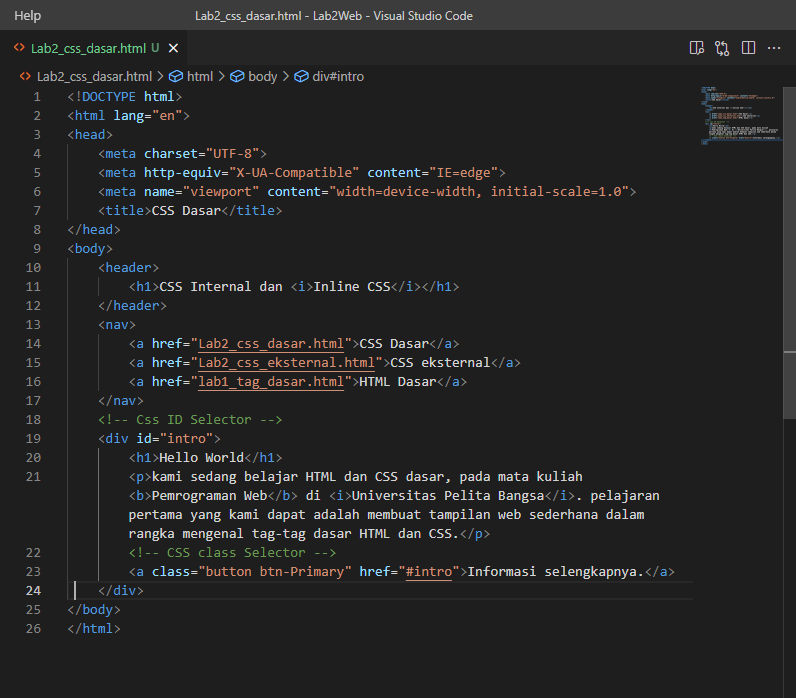

Selanjutnya buka Browser untuk melihat hasilnya
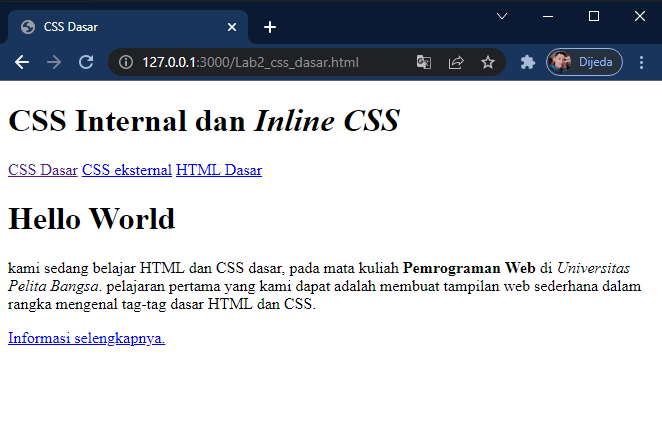

2. Mendeklarasikan CSS Internal
kemudian tambahkan deklarasi tag CSS Internal seperti contoh berikut masukkan tag CSS di dalam < head >
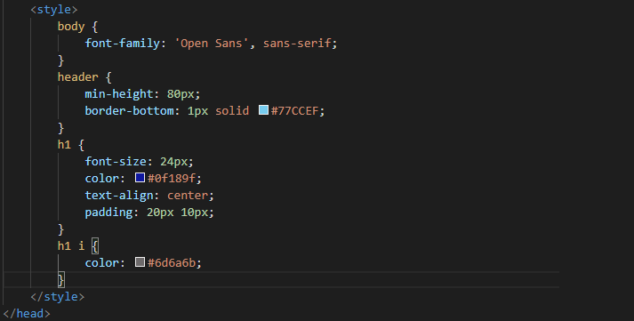

Selanjutnya buka kembali Browser untuk melihat Hasilnya
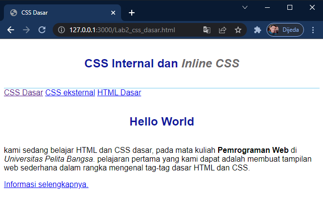

3. menambahkan Inline CSS
Kemudian tambahkan deklarasi inline CSS di dalam Tag < p > seperti berikut.
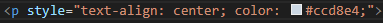

Lalu buka kembali Browser Untuk melihat hasilnya.

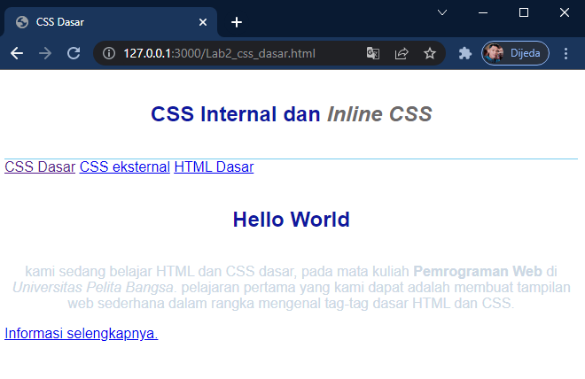

maka hasilnya huruf yang berada di dalam tag < p > berubah warna.

4. Membuat CSS Eksternal
membuat file baru dengan nama style_eksternal.css
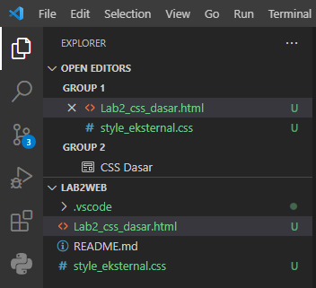

kemudian tambahkan tag < link > untuk merujuk file css yang sudah dibuat di dalam < head >

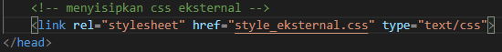

lalu buat tag CSS di file style_eksternal.css tadi contoh tag nya seperti ini

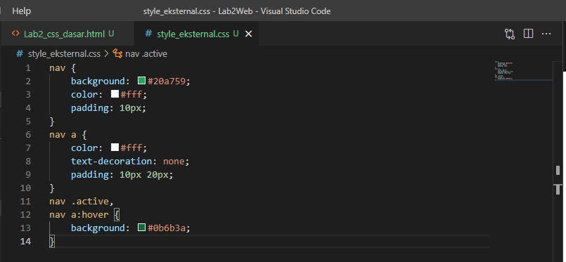

dan hal hasilnya kita buka Browser kembali maka tag css yang di buat tadi berfungsi untuk merubah tampilan warna background dan ukuran padding.

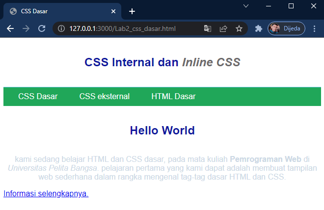

5. Menambahkan CSS Selector
untuk menggunakan selector ID dan Class. pada file CSS, dengan menggunakan kode tag sebagai berikut.
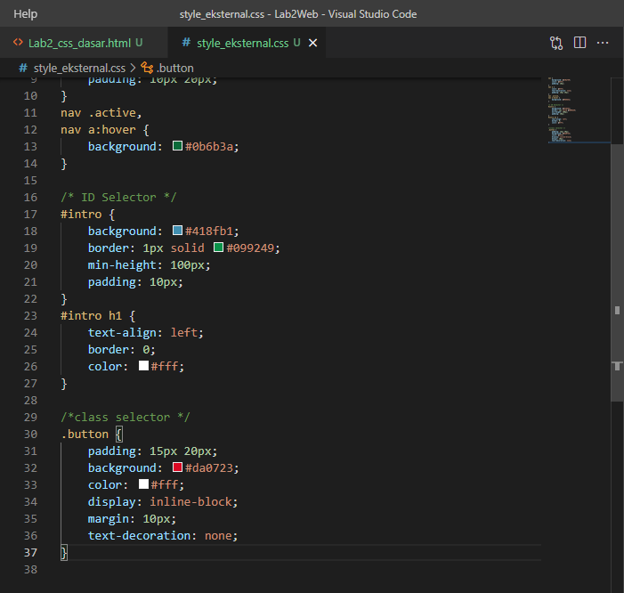

kemudian hasilnya kita buka kembali Browser maka tampilan bentuk web akan berubah seperti ini, dikarenakan kode tag tersebut merubah bentuk tampilan warna background dengan padding kembali terhadap pada bagian yang telah diberi selector tersebut.
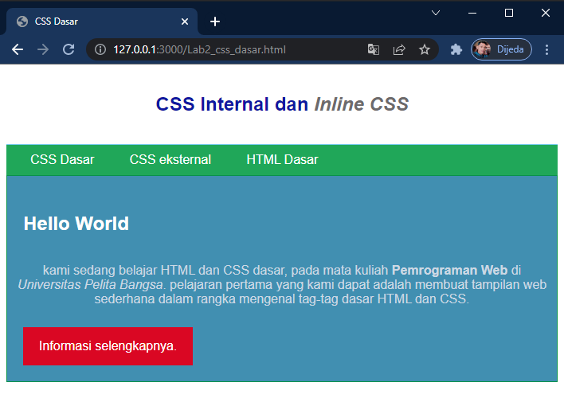

*Pertanyaan dan tugas*

1. Lakukan eksperimen dengan mengubah dan menambah properti dan nilai pada kode CSS dengan mengacu pada CSS Cheat Sheet yang diberikan pada file terpisah dari modul ini.

2. Apa perbedaan pendeklarasian CSS elemen h1 {...} dengan #intro h1 {...}? berikan penjelasannya!
Jawab: 
perbedaan jika dengan tag elemen h1 maka tag yang ber elemen h1 akan ikut berubah semua. namun jika menggunkan selector maka yang akan berubah hanya elemen yang di beri selector saja yang akan berubah.

3. Apabila ada deklarasi CSS secara internal, lalu ditambahkan CSS eksternal dan inline CSS pada elemen yang sama. Deklarasi manakah yang akan ditampilkan pada browser? Berikan penjelasan dan contohnya!
Jawab:
maka yang akan di tampilkan di browser yaitu yang secara internal karna masih pada elemen yang sama contoh nya kita membuat inline pada sebuah huruf.

4. Pada sebuah elemen HTML terdapat ID dan Class, apabila masing-masing selector tersebut terdapat deklarasi CSS, maka deklarasi manakah yang akan ditampilkan pada browser?
Berikan penjelasan dan contohnya! ( 
 ) 
Jawab: 
maka yang akan di tampilkan di browser iyalah dengan selector ID karena sudah ada selector id maka class tidak akan di tampilkan di browser contohnya kita membuat 2 selector maka di saat deklarasi CSS nya kita gunakan deklarasi background color maka yang tampil warna di browser adalah selector ID.